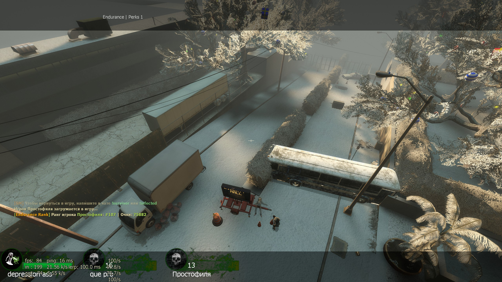
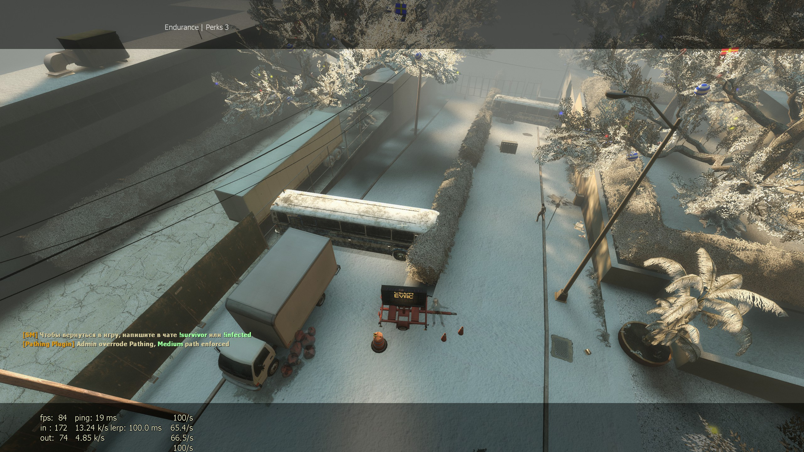
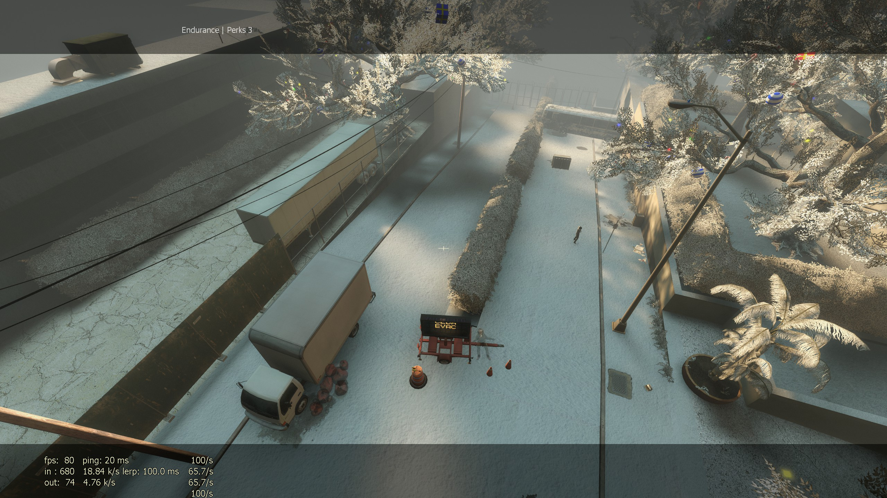

# What's it?

These are the changes for the maps in Left 4 Dead 2

### Why are there 4 folders?

Each of them is used on different servers

### Which one should I use?

The one you like the most. I do not guarantee trouble-free operation of any of them.

### What is Routing?

The same Stripper with fixed bugs, but also a dynamic choice of the path that I made up on my own
- prop is not everywhere matched to the map theme, because the idea was in routes and not textures.

## What are the projects inside?

**RoutingPaths:** Stripper (Fork *[L4D2] Routing (Dynamic Paths)*), .cfg files

**T1 Hard (Sky):** Stripper (Fork *Attano/Sky*), .cfg files

**VscriptRandomObject:** Vscript (Fork *Workshop addons id=2524562871*), .nut files + .nav Meshes files

**Rework:** Stripper + Vscript (Fork *Derpduck/L4D2-Comp-Stripper-Rework*)

## Authors

- [RoutingPaths](https://www.github.com/etozhesandy) + [Routing (Dynamic Paths)](https://forums.alliedmods.net/showthread.php?p=1172643)
- [T1 Hard (Sky)](https://github.com/Attano/Sky)
- [VscriptRandomObject](https://steamcommunity.com/sharedfiles/filedetails/?id=2524562871)
- [Rework](https://github.com/Derpduck/L4D2-Comp-Stripper-Rework)

## Bugs

- There is no navigation grid, bots will stick into objects instead of bypassing them

- Rare server crashes due to stripper error

- The spawn of objects can be changed

# Path Easy

# Path Medium.jpg

# Path Hard.jpg

# Что это?

Это изменения для карт в Left 4 Dead 2.

### Почему тут 4 папки?

Каждая из них используется на разных серверах со своим стилем игры

### Какую из них мне следует использовать?

Ту, которая вам больше нравится. Я не гарантирую безотказную работу любой из них.

### Что такое Routing?

Тот же самый Stripper с исправленными багами но так же динамическим выбором пути который я составлял самостоятельно
- prop не везде подобраны в тему карты ведь идея была в маршрутах а не текстурах.

## Какие проекты находятся внутри?

**RoutingPaths:** Stripper (Fork *[L4D2] Routing (Dynamic Paths)*), .cfg files

**T1 Hard (Sky):** Stripper (Fork *Attano/Sky*), .cfg files

**VscriptRandomObject:** Vscript (Fork *Workshop addons id=2524562871*), .nut files + .nav Meshes files

**Rework:** Stripper + Vscript (Fork *Derpduck/L4D2-Comp-Stripper-Rework*)

## Авторы

- [RoutingPaths](https://www.github.com/etozhesandy) + [Routing (Dynamic Paths)](https://forums.alliedmods.net/showthread.php?p=1172643)
- [T1 Hard (Sky)](https://github.com/Attano/Sky)
- [VscriptRandomObject](https://steamcommunity.com/sharedfiles/filedetails/?id=2524562871)
- [Rework](https://github.com/Derpduck/L4D2-Comp-Stripper-Rework)

## Ошибки

- Отсутствует сетка навигации, боты будут застревать в объектах вместо обхода их.

- Редкие сбои сервера из-за ошибки Stripper.

- Может измениться спавн объектов.

